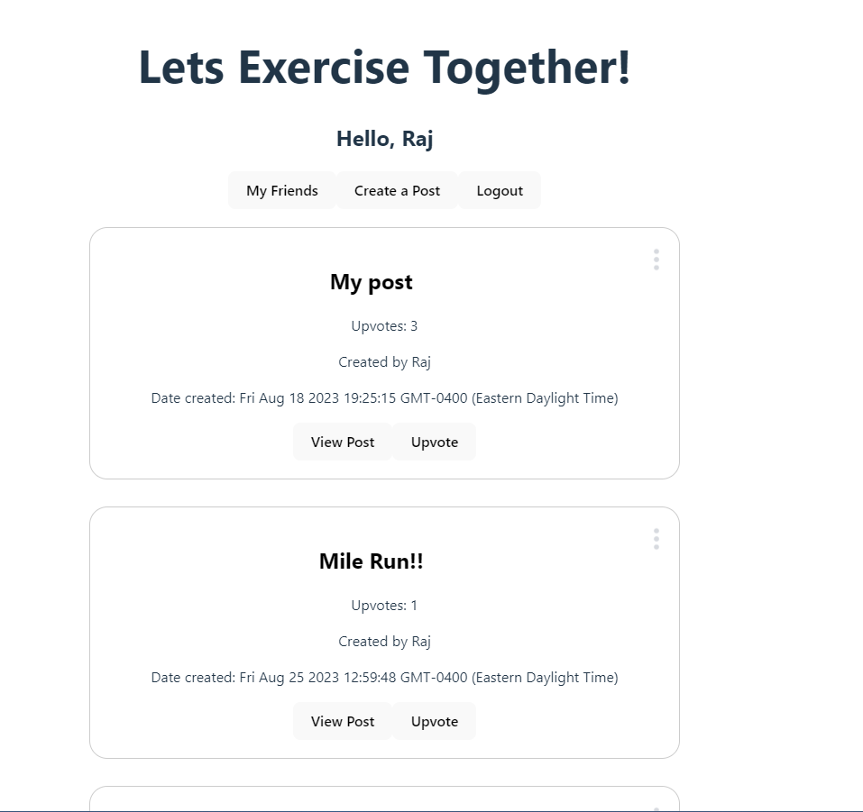
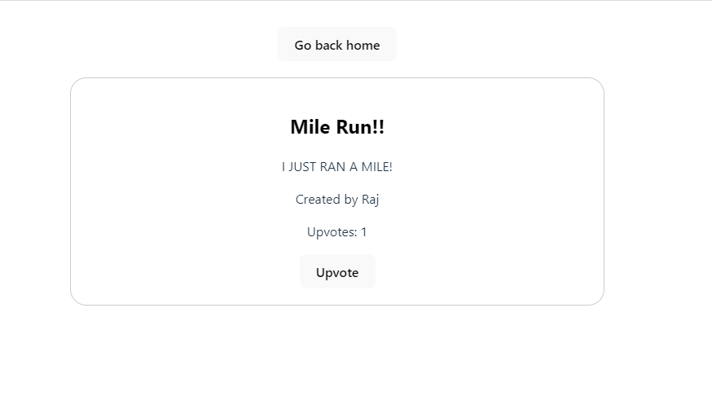

# Exercise_twitter

A Twitter clone focusing on posting about your exercises. Users can login with an account, post, view, edit and delete their own posts as well as add friends to see their posts. 

## Built With
- Javascript
- React.JS
- SupaBase (Postgre SQL)

To Start App: Clone the git repository and then run "npm run dev" this will create a local server using VITE.

```
git clone https://github.com/Raj-Lee-Code/CS361_Microservice.git

npm run dev
```

# Future updates
- Add ability to comment on posts
- add ability to retweet
- add ability to like comments


# Screenshots of app
- Sign-in page


- Home page


- View and Add friends


- View posts



